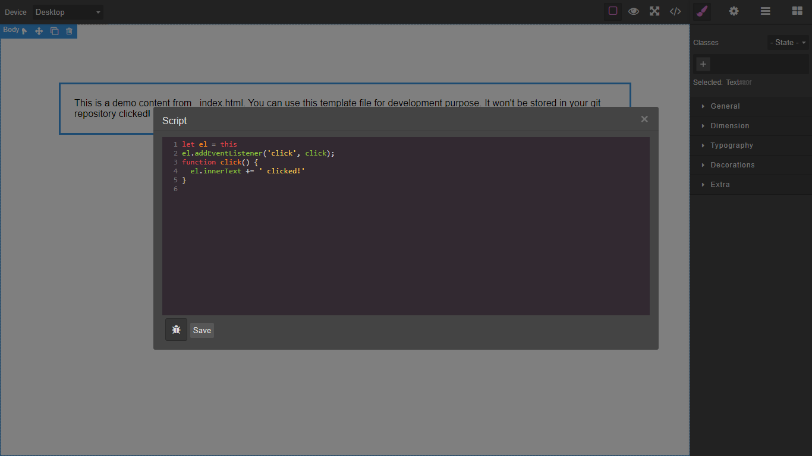

# Grapesjs Script Editor

Attach script to selected component

> Try to add after all components.

<p align="center">
  
</p>

[DEMO](https://codepen.io/ju99ernaut/pen/NWNEWpV)

### HTML
```html
<link href="https://unpkg.com/grapesjs/dist/css/grapes.min.css" rel="stylesheet">
<script src="https://unpkg.com/grapesjs"></script>
<script src="https://unpkg.com/grapesjs-script-editor"></script>

<div id="gjs"></div>
```

### JS
```js
const editor = grapesjs.init({
	container: '#gjs',
  height: '100%',
  fromElement: true,
  storageManager: false,
  plugins: ['grapesjs-script-editor'],
});
```

### CSS
```css
body, html {
  margin: 0;
  height: 100%;
}
```


## Summary

* Plugin name: `grapesjs-script-editor`
* Commands
    * `edit-script`


## Options

| Option | Description | Default |
|-|-|-
| `starter` | Starter code | `let el = this` |
| `toolbarIcon` | Toolbar icon for opening script modal | `<i class="fa fa-puzzle-piece"></i>` | 
| `scriptTypesSupport` | Component types to allow script editing, `avoid components with predefined scripts or scripts set elsewhere` | `['default', 'wrapper', 'text', 'textnode', 'image', 'video', 'svg']` |
| `toolbarBtnCustomScript` | Options to pass when extending toolbar | `{}` |
| `onRun` | Logic to run if debug is successful | `() => console.log('valid syntax')` |
| `onError` | Logic to run if debug finds errors | `err => console.log('error:',err)` |
| `modalTitle` | Title for script modal | `Script` |
| `codeViewOptions` | Additional options for the code viewer | `{}` |
| `buttonLabel` | Label for the default save button | `save` |
| `commandAttachScript` | Object to extend the default `edit-script` command | `{}` |


## Download

* CDN
  * `https://unpkg.com/grapesjs-script-editor`
* NPM
  * `npm i grapesjs-script-editor`
* GIT
  * `git clone https://github.com/Ju99ernaut/grapesjs-script-editor.git`


## Usage

Directly in the browser
```html
<link href="https://unpkg.com/grapesjs/dist/css/grapes.min.css" rel="stylesheet"/>
<script src="https://unpkg.com/grapesjs"></script>
<script src="path/to/grapesjs-script-editor.min.js"></script>

<div id="gjs"></div>

<script type="text/javascript">
  var editor = grapesjs.init({
      container: '#gjs',
      // ...
      plugins: ['grapesjs-script-editor'],
      pluginsOpts: {
        'grapesjs-script-editor': { /* options */ }
      }
  });
</script>
```

Modern javascript
```js
import grapesjs from 'grapesjs';
import plugin from 'grapesjs-script-editor';
import 'grapesjs/dist/css/grapes.min.css';

const editor = grapesjs.init({
  container : '#gjs',
  // ...
  plugins: [plugin],
  pluginsOpts: {
    [plugin]: { /* options */ }
  }
  // or
  plugins: [
    editor => plugin(editor, { /* options */ }),
  ],
});
```


## Development

Clone the repository

```sh
$ git clone https://github.com/Ju99ernaut/grapesjs-script-editor.git
$ cd grapesjs-script-editor
```

Install dependencies

```sh
$ npm i
```

Start the dev server

```sh
$ npm start
```

Build the source

```sh
$ npm run build
```


## License

MIT
